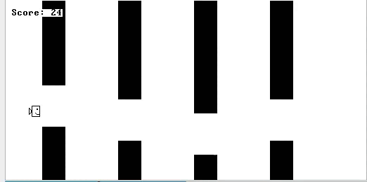

 # Плюсы
 - За файлик readme отдельный респект, все очень понятно и позитивно
 - Структурированный и читаемый код
 - Отличное решение использовать связный список для препятсвий
 - Возможность рестарата

 # Минусы
 - Из-за мигающей картинки играть долгое время действительно тяжело
 - Не учитывая проблем с графикой, игру не так сложно пройти, поэтому хотелось бы либо повышать сложность игры по мере ее прохождения, либо сделать ее бесконечной
 - Класс Game отвечает за выполнение слишком большого количества функций, стоит разбить на вспомогательные классы
 - Немного некорректная обработка столкновения

 