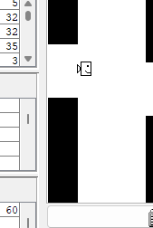

**Плюсы:**

1) Очень хорошо форматированный и структурированный код

2) Приятный интерфейс

3) Простая и интересная игра

**Недостатки:**

1) Мне кажется, было бы лучше сделать так, чтобы блоки плавно появлялись из правого края экрана и плавно уходили за левый край экрана, а не моментально появлялись и пропадали

2) Мне кажется, стоит увеличить количество очков для победы, или вообще сделать игру бесконечной, а то игра очень быстро заканчивается

**Предложения:**

1) Было бы классно добавить настройку скорости для препятствий

2) Добавить комментарии к методам и классам
